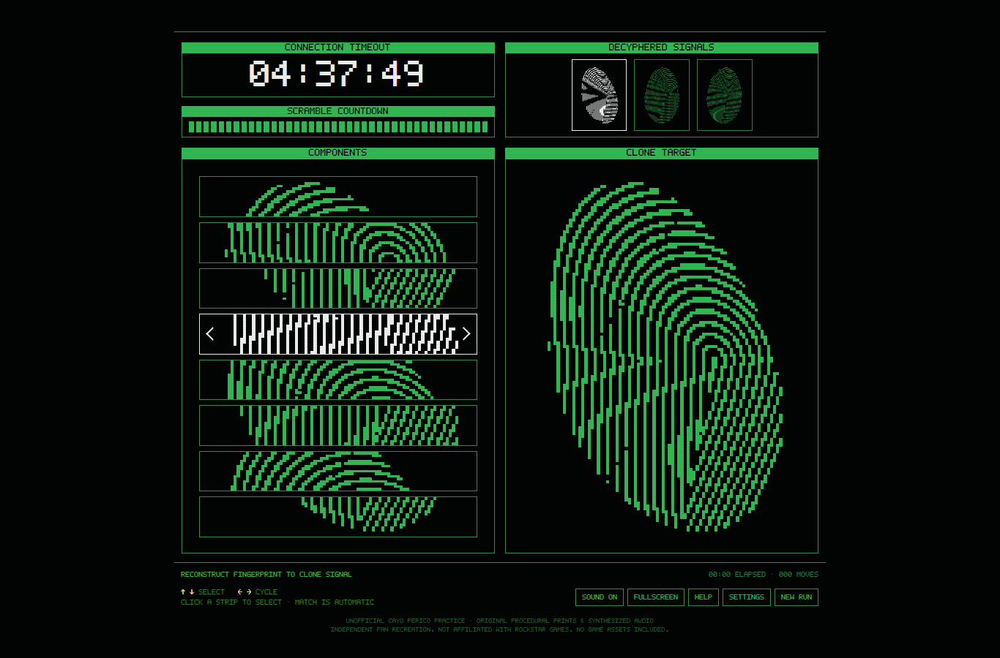
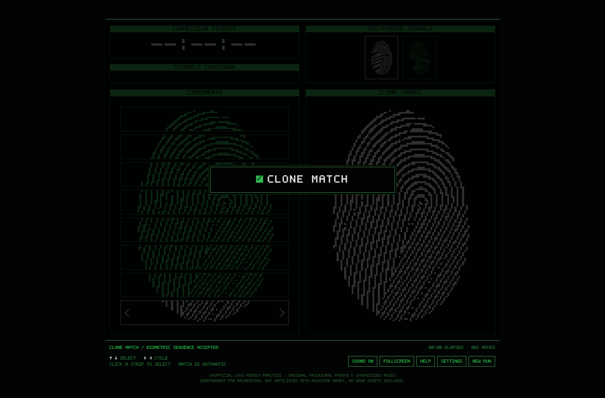
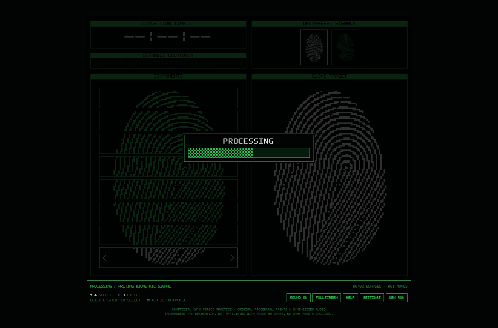
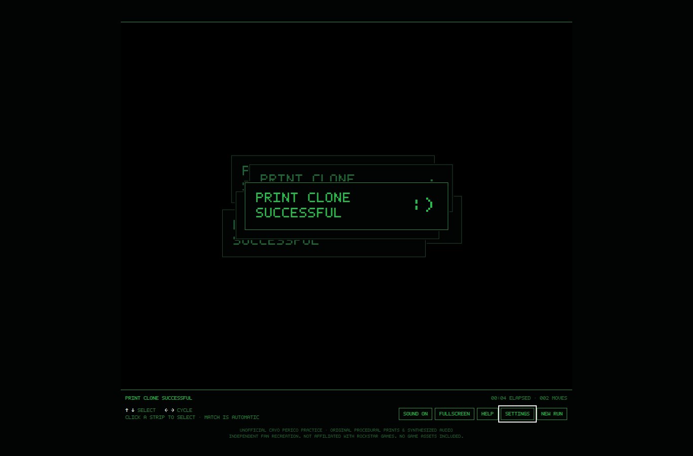

<div align="center">

# Cayo Perico · Fingerprint Practice

**Eight slices. One matching print. Beat the connection timer.**

A playable, offline fingerprint-cloner practice game inspired by GTA Online's Cayo Perico heist.

**One HTML file · No installation · No dependencies · Works offline**

[**Download the game**](https://github.com/DinoJTV/cayo-perico-fingerprint-practice/raw/refs/heads/main/index.html?download=1) · [Controls](#controls) · [How to solve](#how-to-solve) · [Screenshots](#screenshots)



</div>

## Play in seconds

1. **Download [index.html](https://github.com/DinoJTV/cayo-perico-fingerprint-practice/raw/refs/heads/main/index.html?download=1)** and save it to your computer.
2. Open the saved file in **Chrome or Edge**.
3. Choose **Connect · timed** or **Practice · no timer**.

Everything needed to play is inside `index.html`, including the graphics, pixel font, and synthesized audio. No server, account, internet connection, or build step is required. The images in this repository are just for the README.

## Inside the terminal

| Feature | What it does |
| --- | --- |
| **Eight real fingerprint slices** | Every component cycles through crops of the current target, in top-to-bottom order. |
| **Randomized puzzles** | New prints and starting positions each run. Some scrambled rows may already be correct. |
| **Timed sessions** | Default 4:55 connection timer and a 60-second scramble interval. Both are configurable. |
| **Untimed practice** | Learn the sequence without a connection timeout or automatic scrambles. |
| **1–4 fingerprints** | Choose the length of each session in Settings. |
| **Pixel terminal visuals** | Original pixel-built fingerprints, an embedded block font, green title bars, and white selected fragments. |
| **Completion sequences** | Centered **CLONE MATCH**, a checkerboard **PROCESSING** bar, then stacked **PRINT CLONE SUCCESSFUL :)** windows. |
| **Sound & display options** | Synthesized UI sounds, mute, fullscreen, and reduced visual effects. |

## Controls

| Action | Keyboard | Mouse / touch |
| --- | --- | --- |
| Select a component | **↑ / ↓** or **W / S** | Click or tap a strip |
| Cycle its fragment | **← / →** or **A / D** | Use the strip's left / right arrows |
| Toggle sound | **M** | **Sound** button |
| Toggle fullscreen | **F** | **Fullscreen** button |
| Open help | **?** | **Help** button |
| Close help or settings | **Esc** | **Return / Resume** button |
| Start a new session | — | **New run** button |

Matching is automatic: there is no submit button. Basic gamepad input is also implemented: D-pad / left stick to select and cycle, A to cycle right, and B to cycle left. Physical controller compatibility has not been verified.

## How to solve

Find the **top slice** of the target. Every row cycles through the same eight slices in the same order:

| Component | Starting from the top slice, move right… |
| :---: | :---: |
| 1 | 0 times |
| 2 | 1 time |
| 3 | 2 times |
| 4 | 3 times |
| 5 | 4 times |
| 6 | 5 times |
| 7 | 6 times |
| 8 | 7 times |

You can also match the ridge shapes directly. Check the current arrangement first—some rows may already be in the correct position.

## Screenshots

<table>
  <tr>
    <td width="50%"><br><strong>01 · Clone match</strong><br>The assembled print is accepted automatically.</td>
    <td width="50%"><br><strong>02 · Processing</strong><br>The signal is written before the next fingerprint.</td>
  </tr>
  <tr>
    <td colspan="2" align="center"><br><strong>03 · Print clone successful :)</strong><br>The final signal completes the session.</td>
  </tr>
</table>

## Practice behavior

- Opening Help or Settings pauses the session. Switching to another tab also pauses it.
- Applying Settings starts a fresh run; closing Settings resumes the current run.
- Scrambling resets only the current fingerprint's components. Completed signals remain completed.
- The final accepted match completes successfully even if its animation extends beyond the remaining connection time.
- The timing defaults are adjustable training settings. The fingerprints are procedurally generated, so this trains the sequence and visual matching rather than memorization of the game's fixed artwork.

## Project files

```text
index.html          The complete playable game
README.md           Instructions and screenshot gallery
docs/images/        Screenshots used in this README
```

The game uses plain HTML, CSS, Canvas, and Web Audio. To customize it, edit `index.html` and reopen or refresh the file in your browser.

Browser checks cover complete three-print sessions, keyboard and mouse controls, scrambles, timeout failures, replay, settings, fullscreen, small-screen layouts, and the full completion sequence. The game makes no external network requests.

---

**Independent fan-made practice recreation.** Not affiliated with or endorsed by Rockstar Games or Take-Two Interactive. GTA Online and Cayo Perico are referenced to identify the minigame being practiced. Fingerprint graphics, the embedded pixel font, and sounds are original/procedural; no extracted Rockstar assets are included.
